# BST Fitness

## 목차
>1. 기획의도
>2. 팀원구성
>3. 개발환경
>4. 기술구현 내용
>5. DB ERD
>6. 페이지 소개
>      1. 로그인
>      2. 회원가입
>      3. 메인
>      4. 트레이너 소개
>      5. 트레이너 리뷰
>      6. 회원권 등록
>      7. PT 예약하기
>      8. Q&A
>      9. My Page
>         1. Member
>         2. Trainer
>7. 성과

# 1. 기획의도

* 현재 수면 위에 올라온 헬스장 정찰제 이슈에 맞춰 정찰제를 통한 멤버쉽/PT 가격을 소비자에게 제공하므로써 소비자로 하여금 정당한 가격선택의 기회를 제공하고 추가로 인터넷을 통한 PT스케쥴 예약기능을 통해 소비자로 하여금 보다 자유로운 스케쥴 관리를 가능하게 하기 위하여 'BST Fitness'라는 헬스장 웹페이지 프로젝트를 기획하게 되었다.

# 2. 팀원구성

* 김리영
* 곽헌섭
* 전준호
* 천웅재

# 3. 개발환경

* Front-end : javascript / jsp / jquery/ bootstrap
* Back-end : java / spring
* DB : oracle
* OS : windows 10

# 4. 기술 구현 내용

* 멤버쉽 / PT 결제
* PT 스케쥴 예약
* 트레이너 리스트 및 트레이너 리뷰
* Q&A 게시판
* 마이 페이지

# 5. DB ERD

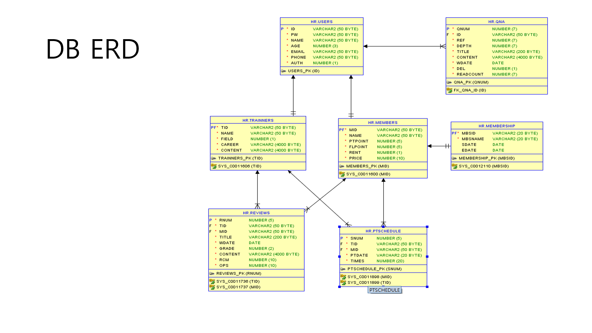

# 6. 페이지 소개

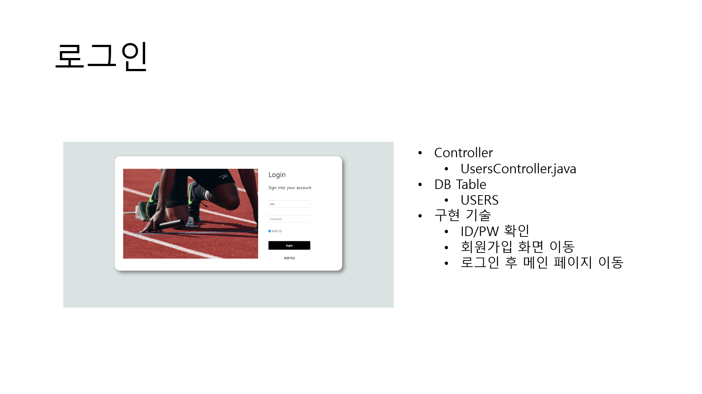

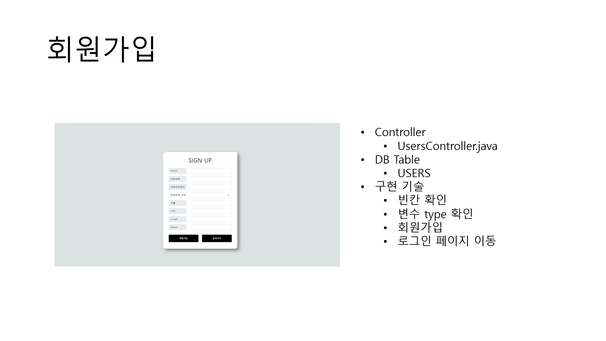

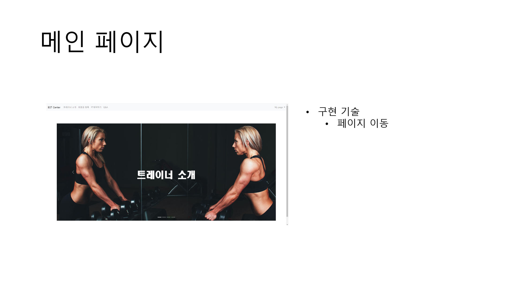

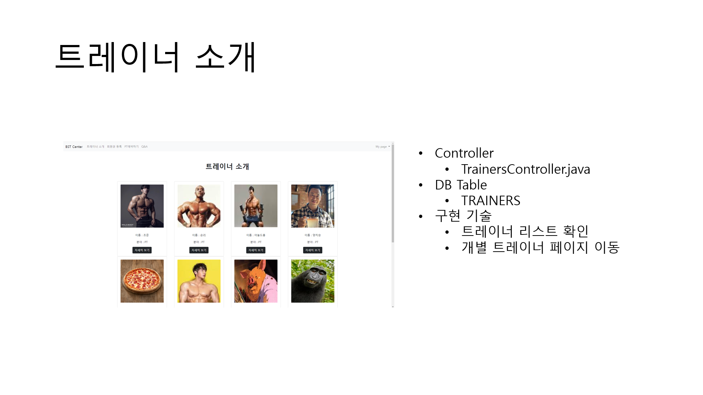

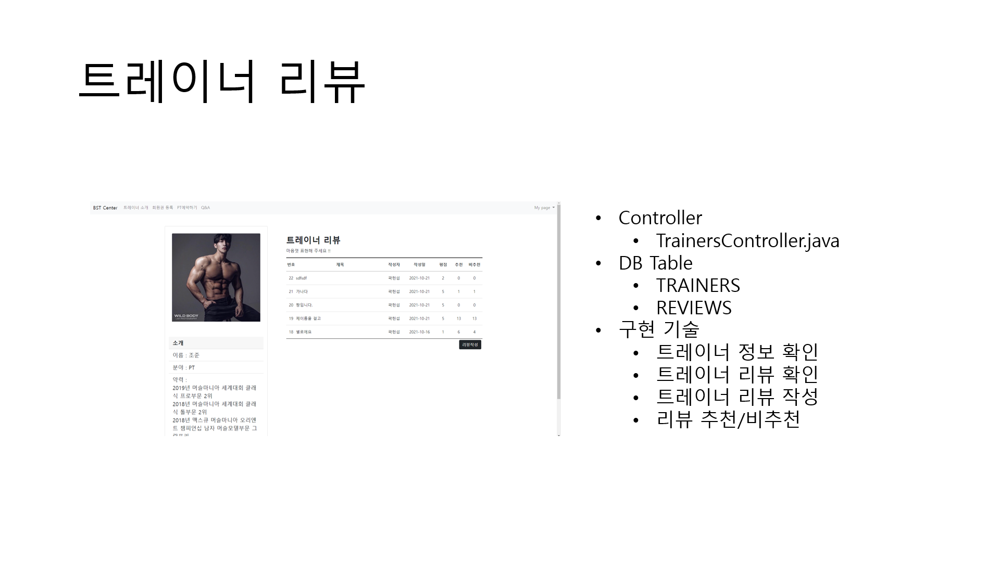

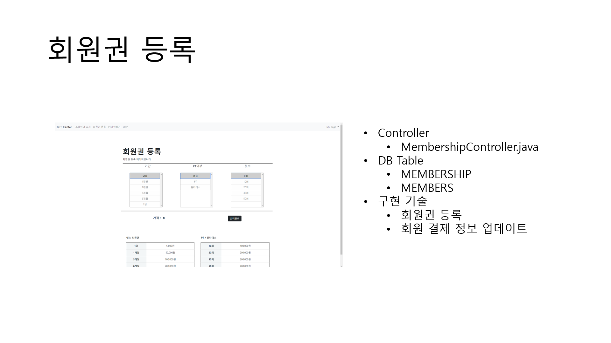

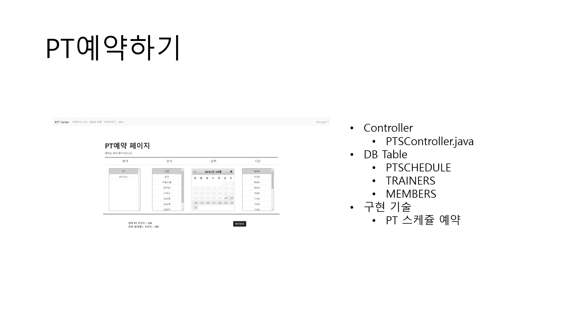

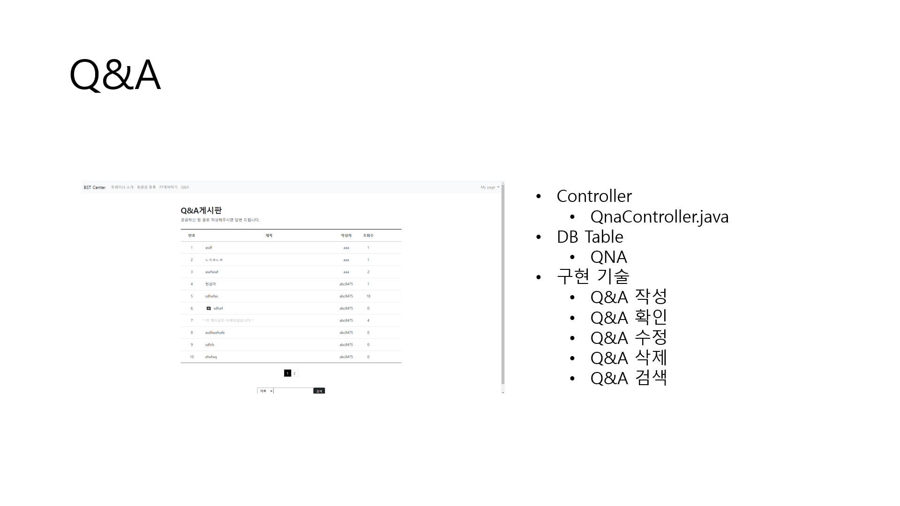

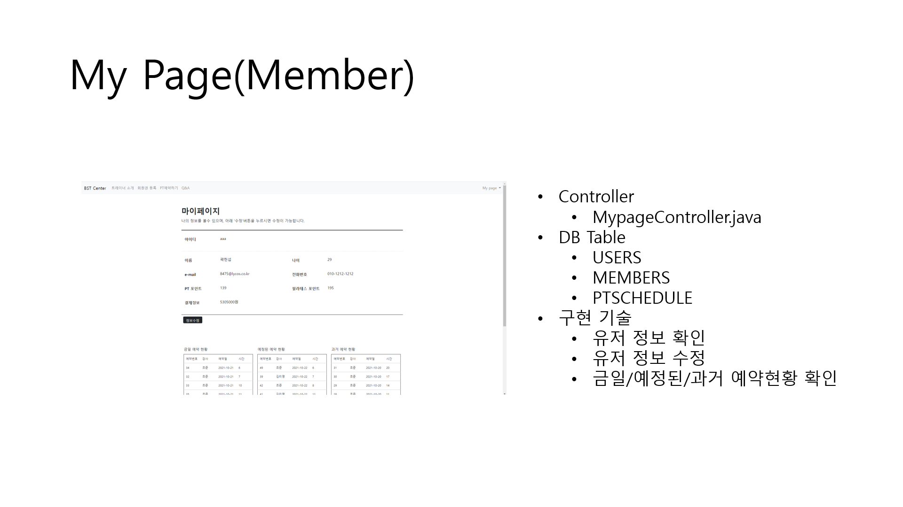

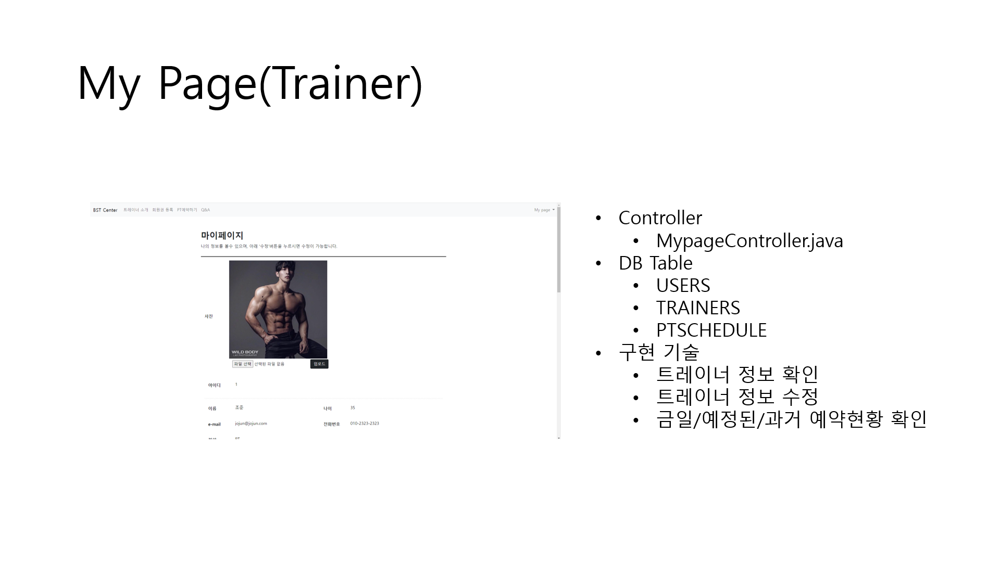

# 7. 성과

* 나를 제외한 모든 조원들이 비전공자였기 때문에 팀원들이 구성원으로서 최대한의 역량을 펼치기 위해서는 프로젝트의 기틀을 잡아주는 부분이 필요하다고 생각했다. 그러한 이유로 프로젝트를 들어가기 전 spring을 위한 사전 준비작업을 필요로 했고 이 과정을 통해서 개인적으로도 spring setting에 대한 이해도를 높일 수 있었다.
* 나 또한 Spring공부를 마치고 바로 시작한 프로젝트였기 때문에 시작부터 Spring에 대한 완벽한 이해를 동반한 상태로 프로젝트를 진행하진 못하였다. 그렇기 때문에 프로젝트를 진행하면서 자잘한 실수들이 있었고 오히려 그 실수들을 통해서 Spring에 대한 이해도를 높일 수 있었다.
* 가장 큰 성과는 팀원들과 협동을 통해서 무언가를 이루어냈다는 점이라고 생각한다. 팀원들 모두가 비전공자임에도 불구하고 자신의 역할을 해내기 위하여 최선을 다해줬고 그 덕분에 어느정도 틀이 잡혀있는 상황에서 내가 투입해 마무리를 지어줄 수 있었다고 생각한다. 그리고 무엇보다도 front-end부분에서 모두들 최선을 다해줬고 결과물을 보여줬기 때문에 back-end 부분의 마무리 작업을 편안한 마음으로 할 수 있었고 기한안에 프로젝트를 무난히 마무리 지을수 있었다고 생각한다.
